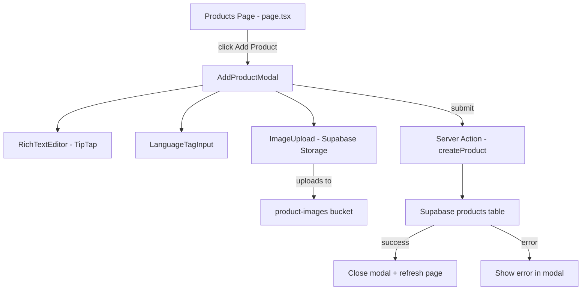
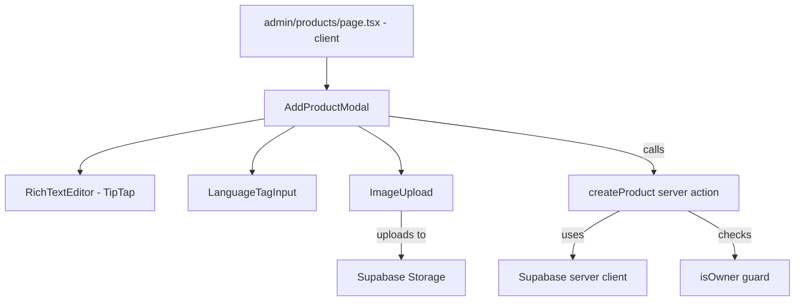

# Add Product Modal — Implementation Plan

## Overview

Wire the existing "Add Product" button on [`/admin/products`](src/app/admin/products/page.tsx:1) to open a full-screen modal with a form for inserting a new product into a Supabase `products` table. The form includes a TipTap rich text editor for the description field, a custom tag-input for language codes, and an image upload component for product thumbnails (stored in Supabase Storage).

---

## Architecture



---

## 1. Supabase `products` Table Schema (+ Storage Bucket)

Create the table directly in the Supabase SQL Editor. A migration file will also be saved locally for reference at [`supabase/migrations/001_create_products.sql`](supabase/migrations/001_create_products.sql).

### Columns

| Column | Type | Constraints | Notes |
|--------|------|-------------|-------|
| `id` | `uuid` | PK, default `gen_random_uuid()` | Auto-generated |
| `title` | `text` | NOT NULL | Product name |
| `price` | `numeric(10,2)` | NOT NULL, CHECK >= 0 | USD price |
| `description` | `text` | NOT NULL | HTML content from TipTap |
| `category` | `text` | NOT NULL | Free-text category |
| `affiliate_fee` | `numeric(5,2)` | NOT NULL, CHECK 0-100 | Percentage |
| `item_type` | `text` | NOT NULL, CHECK IN list | Enum: Key, In-Game item, Account, Subscription |
| `content` | `text` | NOT NULL | Content of the item |
| `additional_info` | `text` | | Optional additional information |
| `activation_instructions` | `text` | | Optional activation instructions |
| `languages` | `text[]` | NOT NULL, default `{}` | Array of 2-letter codes |
| `image_url` | `text` | | Public URL from Supabase Storage |
| `created_at` | `timestamptz` | default `now()` | Auto timestamp |
| `updated_at` | `timestamptz` | default `now()` | Auto timestamp |

### RLS Policy

- **INSERT**: Only authenticated users whose email is in the owner list (or `app_metadata.role = 'owner'`)
- **SELECT**: Public read access (products are visible to everyone)
- **UPDATE/DELETE**: Owner-only

### Supabase Storage Bucket

A public bucket named `product-images` is required for thumbnail uploads:
- **SELECT**: Public (anyone can view images)
- **INSERT**: Owner-only
- **DELETE**: Owner-only
- Max file size: 5 MB, image types only (PNG, JPG, WebP)

---

## 2. New Dependencies

Install TipTap packages for the rich text editor:

```
npm install @tiptap/react @tiptap/pm @tiptap/starter-kit @tiptap/extension-underline @tiptap/extension-link @tiptap/extension-placeholder
```

No other new dependencies needed — Supabase client is already installed.

---

## 3. New Files

### 3a. [`supabase/migrations/001_create_products.sql`](supabase/migrations/001_create_products.sql)

SQL migration file for reference. The owner will run this in the Supabase SQL Editor.

- CREATE TABLE `products` with all columns listed above
- CREATE INDEX on `category` and `item_type`
- Enable RLS
- CREATE POLICY for insert (owner-only) and select (public)
- CREATE trigger for auto-updating `updated_at`

### 3b. [`src/types/product.ts`](src/types/product.ts)

TypeScript interface matching the database schema:

```typescript
export interface Product {
  id: string;
  title: string;
  price: number;
  description: string;
  category: string;
  affiliate_fee: number;
  item_type: 'Key' | 'In-Game item' | 'Account' | 'Subscription';
  content: string;
  additional_info: string | null;
  activation_instructions: string | null;
  languages: string[];
  image_url: string | null;
  created_at: string;
  updated_at: string;
}

export type CreateProductInput = Omit<Product, 'id' | 'created_at' | 'updated_at'>;

export const ITEM_TYPES = ['Key', 'In-Game item', 'Account', 'Subscription'] as const;
```

### 3c. [`src/components/admin/RichTextEditor.tsx`](src/components/admin/RichTextEditor.tsx)

Client component wrapping TipTap:

- **Props**: `value: string`, `onChange: (html: string) => void`, `placeholder?: string`
- **Toolbar**: Bold, Italic, Underline, Strikethrough, Link, Bullet list, Ordered list, Heading levels
- **Styling**: Dark theme matching `dark-card` / `dark-border` palette
- **Extensions**: StarterKit, Underline, Link, Placeholder

### 3d. [`src/components/admin/LanguageTagInput.tsx`](src/components/admin/LanguageTagInput.tsx)

Client component for entering multiple 2-letter language codes:

- **Props**: `value: string[]`, `onChange: (langs: string[]) => void`
- **Behavior**: Text input that adds a tag on Enter/comma, validates max 2 chars, lowercases automatically, prevents duplicates
- **UI**: Tags displayed as pills with × remove button, styled with accent color

### 3e. [`src/components/admin/ImageUpload.tsx`](src/components/admin/ImageUpload.tsx)

Client component for uploading product thumbnail images:

- **Props**: `value: string | null`, `onChange: (url: string | null) => void`
- **Behavior**: Click or drag-and-drop to upload; uploads directly to Supabase Storage `product-images` bucket; shows preview with remove button on hover
- **Validation**: Image files only, max 5 MB
- **UI**: Dashed border drop zone when empty, image preview with × overlay when uploaded

### 3f. [`src/components/admin/AddProductModal.tsx`](src/components/admin/AddProductModal.tsx)

Client component — the main modal:

- **Props**: `open: boolean`, `onClose: () => void`, `onSuccess: () => void`
- **Layout**: Full-screen overlay with centered scrollable panel (max-w-2xl)
- **Form fields** (in order):
  1. **Product Thumbnail** — `<ImageUpload>` optional
  2. **Title** — `<input type="text">` required
  3. **Price (USD)** — `<input type="number" step="0.01" min="0">` required
  4. **Category** — `<input type="text">` required
  5. **Item Type** — `<select>` dropdown with Key, In-Game item, Account, Subscription
  6. **Affiliate Fee (%)** — `<input type="number" step="0.01" min="0" max="100">` required
  7. **Description** — `<RichTextEditor>` required
  8. **Content of the item** — `<textarea>` required
  9. **Additional Information** — `<textarea>` optional
  10. **Activation Instructions** — `<textarea>` optional
  11. **Languages** — `<LanguageTagInput>` required (at least one)
- **Footer**: Cancel button + Submit button (accent purple)
- **Submit**: Calls server action, shows loading spinner, handles errors inline
- **Close behavior**: Clicking overlay or Cancel closes; Escape key closes

### 3g. [`src/app/admin/products/actions.ts`](src/app/admin/products/actions.ts)

Next.js Server Action file:

```typescript
'use server';
```

- `createProduct(input: CreateProductInput)` — validates input server-side, creates Supabase server client, inserts into `products` table, returns `{ success: true, product }` or `{ success: false, error: string }`
- Server-side owner check using `isOwner()` before insert
- Input validation: title non-empty, price >= 0, affiliate_fee 0-100, item_type in allowed list, languages array non-empty with each entry being 2 chars

---

## 4. Modified Files

### 4a. [`src/app/admin/products/page.tsx`](src/app/admin/products/page.tsx:1)

- Convert to `'use client'` component (needed for modal state)
- Add `useState` for `modalOpen`
- Wire "Add Product" button `onClick` to `setModalOpen(true)`
- Render `<AddProductModal>` with open/close/success handlers
- On success: close modal + call `router.refresh()` to re-fetch data

---

## 5. Component Hierarchy



---

## 6. Modal Form Layout Wireframe

```
┌─────────────────────────────────────────────┐
│  ✕                  Add Product              │
├─────────────────────────────────────────────┤
│                                             │
│  Thumbnail      ┌──────────────┐            │
│                 │  📷 Drop or  │            │
│                 │  click here  │            │
│                 └──────────────┘            │
│                                             │
│  Title          [________________________]  │
│                                             │
│  Price (USD)    [________]  Aff. Fee [___]% │
│                                             │
│  Category       [________]  Type [▼ Key  ]  │
│                                             │
│  Description                                │
│  ┌─ B I U S ~ 🔗 • 1. H1 H2 ────────────┐ │
│  │                                        │ │
│  │  Rich text editor area                 │ │
│  │                                        │ │
│  └────────────────────────────────────────┘ │
│                                             │
│  Content        [________________________]  │
│                 [________________________]  │
│                                             │
│  Additional     [________________________]  │
│  Information    [________________________]  │
│                                             │
│  Activation     [________________________]  │
│  Instructions   [________________________]  │
│                                             │
│  Languages      [en] [es] [de] [____]       │
│                                             │
├─────────────────────────────────────────────┤
│              [Cancel]  [Add Product]         │
└─────────────────────────────────────────────┘
```

---

## 7. Execution Order

1. Write SQL migration file and run it in Supabase SQL Editor
2. Install TipTap npm dependencies
3. Create `src/types/product.ts` type definitions
4. Create `src/components/admin/RichTextEditor.tsx`
5. Create `src/components/admin/LanguageTagInput.tsx`
6. Create `src/components/admin/AddProductModal.tsx`
7. Create `src/app/admin/products/actions.ts` server action
8. Update `src/app/admin/products/page.tsx` to wire up the modal
9. Test the full flow: open modal → fill form → submit → verify in Supabase
10. Commit and push
