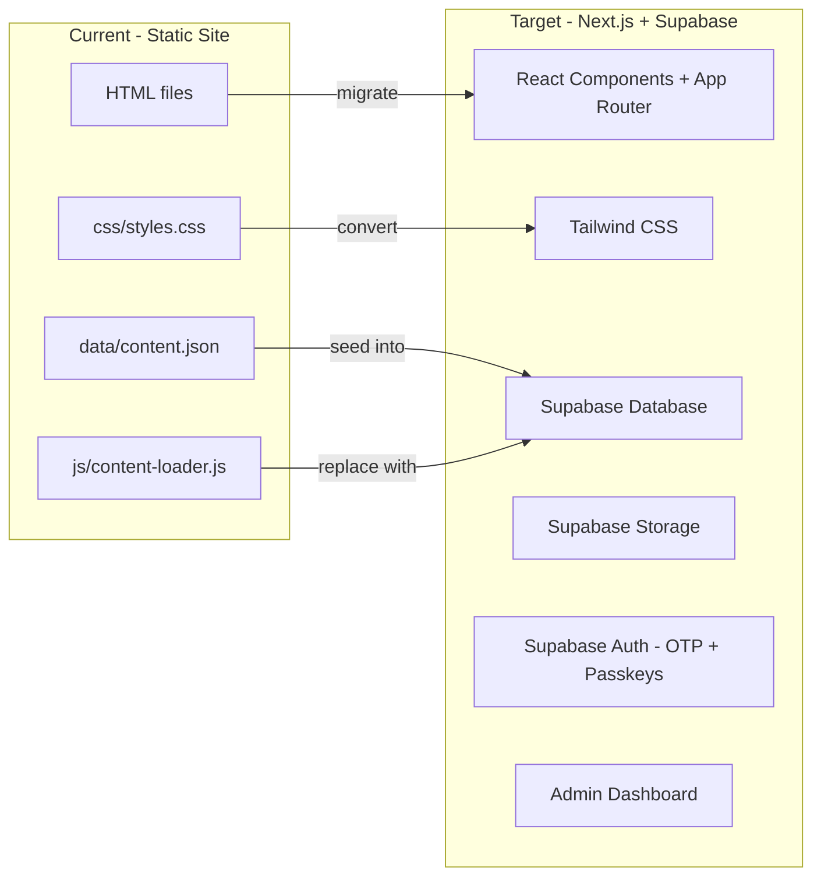
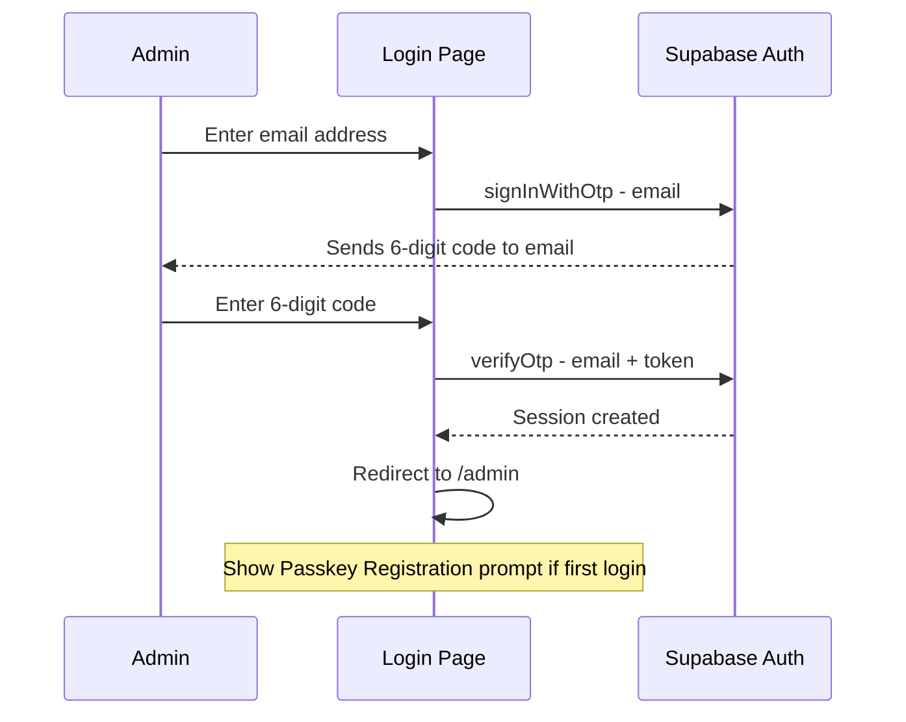
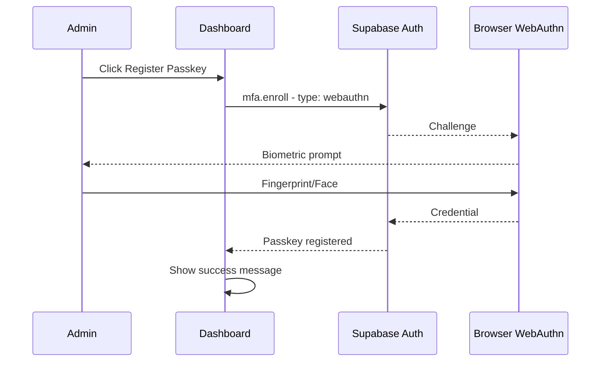
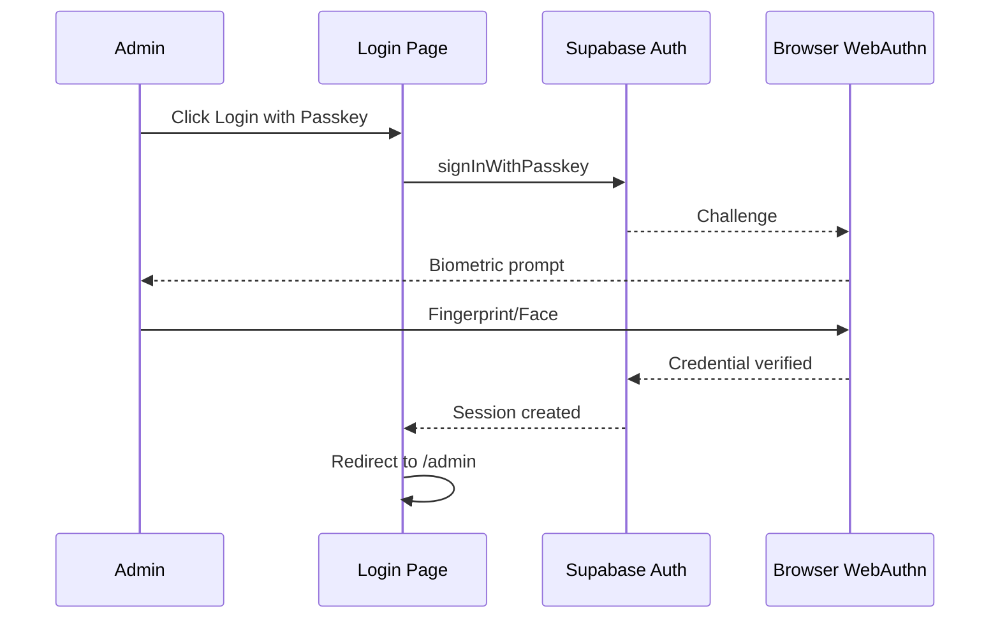
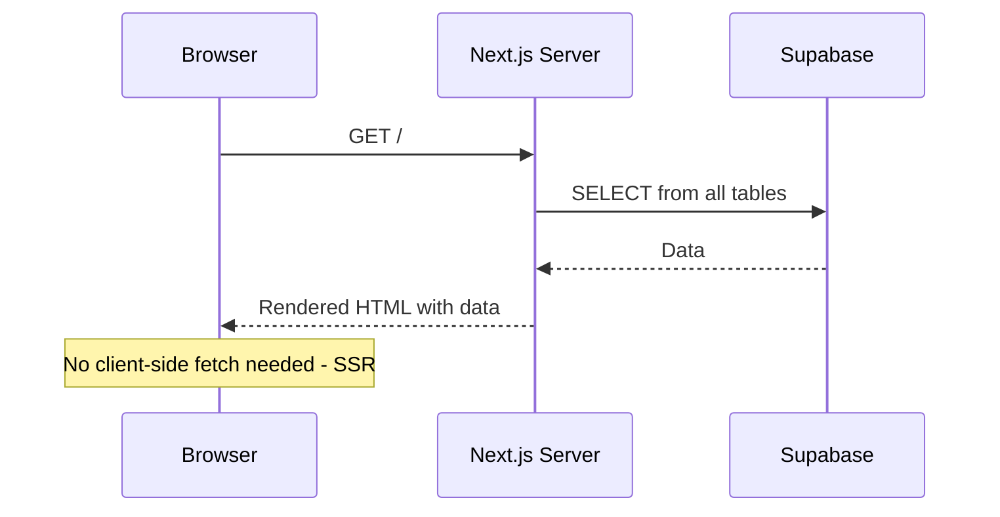
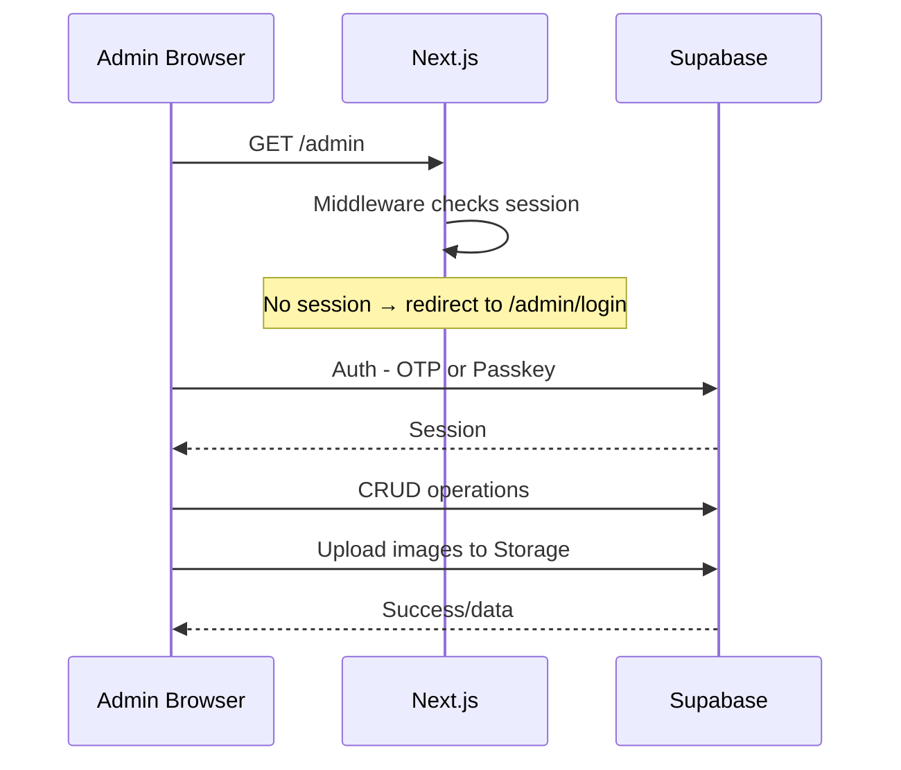

# DamnModz — Next.js + Supabase Migration Plan

## Overview

Migrate the entire DamnModz static HTML/CSS/JS site to:
- **Next.js 14** with App Router and TypeScript
- **Tailwind CSS** for styling (replacing plain CSS)
- **Supabase** for database, storage, and authentication
- **Email OTP + Passkey** auth flow for the admin panel

---

## Current State → Target State



---

## Project Structure

```
damnmodz-website/
├── .env.local                          ← Supabase credentials
├── next.config.js
├── tailwind.config.ts
├── tsconfig.json
├── package.json
├── sql/
│   └── schema.sql                      ← Tables + RLS + seed data
├── public/
│   └── img/
│       └── dead-island-2-logo.png      ← Kept from current site
├── src/
│   ├── lib/
│   │   ├── supabase/
│   │   │   ├── client.ts               ← Browser Supabase client
│   │   │   ├── server.ts               ← Server-side Supabase client
│   │   │   └── middleware.ts            ← Auth session refresh
│   │   └── types/
│   │       └── database.ts             ← TypeScript types for DB tables
│   ├── components/
│   │   ├── Header.tsx                  ← Logo + nav (data from Supabase)
│   │   ├── FeaturedBanner.tsx          ← Hero banner with slideUp animation
│   │   ├── DiscountedSidebar.tsx       ← Sidebar game list
│   │   ├── GameCard.tsx                ← Individual game card
│   │   ├── StarRating.tsx              ← Star display component
│   │   └── auth/
│   │       ├── OtpLoginForm.tsx        ← Email input → OTP code entry
│   │       ├── PasskeyRegister.tsx     ← Register passkey button
│   │       └── PasskeyLogin.tsx        ← Login with passkey button
│   ├── app/
│   │   ├── layout.tsx                  ← Root layout (Header, dark bg, fonts)
│   │   ├── page.tsx                    ← Home: hero section
│   │   ├── browse-games/
│   │   │   └── page.tsx
│   │   ├── blog/
│   │   │   └── page.tsx
│   │   ├── affiliate-program/
│   │   │   └── page.tsx
│   │   ├── contact-us/
│   │   │   └── page.tsx
│   │   ├── admin/
│   │   │   ├── layout.tsx              ← Auth guard wrapper
│   │   │   ├── page.tsx                ← Dashboard (tabs: settings, banners, games)
│   │   │   └── login/
│   │   │       └── page.tsx            ← OTP + Passkey login page
│   │   └── auth/
│   │       └── callback/
│   │           └── route.ts            ← Supabase auth callback handler
│   └── middleware.ts                   ← Next.js middleware for session refresh
└── old/                                ← Archive of current static files
```

---

## Database Schema

### Table: `site_settings`

| Column | Type | Default | Description |
|--------|------|---------|-------------|
| `id` | `int4` | `1` | Always 1 - single row |
| `logo_text_left` | `text` | `DAMN` | Left part of logo |
| `logo_text_right` | `text` | `MODZ` | Right part - purple |
| `logo_href` | `text` | `/` | Logo link |
| `updated_at` | `timestamptz` | `now` | Last edit |

### Table: `nav_items`

| Column | Type | Default | Description |
|--------|------|---------|-------------|
| `id` | `uuid` | `gen_random_uuid` | PK |
| `label` | `text` | — | Display text |
| `href` | `text` | — | Link destination |
| `sort_order` | `int4` | `0` | Display order |
| `created_at` | `timestamptz` | `now` | — |

### Table: `featured_banners`

| Column | Type | Default | Description |
|--------|------|---------|-------------|
| `id` | `uuid` | `gen_random_uuid` | PK |
| `background_image` | `text` | — | Storage or external URL |
| `background_alt` | `text` | empty | Alt text |
| `logo_image` | `text` | — | Storage or external URL |
| `logo_alt` | `text` | empty | Alt text |
| `title` | `text` | — | Game title |
| `platforms` | `text[]` | empty array | Platform strings |
| `platforms_label` | `text` | `Available on:` | Label |
| `description` | `text` | — | Banner text |
| `cta_text` | `text` | `Take It Now!` | Button text |
| `cta_href` | `text` | `#` | Button link |
| `price_label` | `text` | `Starting at` | Price prefix |
| `price_value` | `text` | — | Price string |
| `sort_order` | `int4` | `0` | Carousel order |
| `is_active` | `bool` | `true` | Show/hide |
| `created_at` | `timestamptz` | `now` | — |

### Table: `discounted_games`

| Column | Type | Default | Description |
|--------|------|---------|-------------|
| `id` | `uuid` | `gen_random_uuid` | PK |
| `thumbnail` | `text` | — | Storage or external URL |
| `name` | `text` | — | Game name |
| `rating` | `int4` | `5` | 1-5 stars |
| `price` | `text` | — | Price display |
| `href` | `text` | `#` | Link |
| `sort_order` | `int4` | `0` | Display order |
| `is_active` | `bool` | `true` | Show/hide |
| `created_at` | `timestamptz` | `now` | — |

---

## Supabase Storage

### Bucket: `images`

- **Public access**: Yes
- **Folders**: `banners/`, `logos/`, `thumbnails/`
- **Allowed types**: `image/png`, `image/jpeg`, `image/webp`, `image/gif`
- **Max size**: 5MB

---

## Row Level Security

All 4 tables:

| Operation | Policy |
|-----------|--------|
| `SELECT` | Anyone - `true` |
| `INSERT` | Authenticated - `auth.role = authenticated` |
| `UPDATE` | Authenticated - `auth.role = authenticated` |
| `DELETE` | Authenticated - `auth.role = authenticated` |

Storage bucket `images`:
- **Read**: Public
- **Write/Delete**: Authenticated only

---

## Authentication Flow

### Email OTP Login



### Passkey Registration (after first OTP login)



### Passkey Login



---

## UI Design

### Login Page (`/admin/login`)

- Dark background `#111`
- Centered card with subtle border
- **Step 1**: Email input + "Send Code" button (purple `#8b5cf6`)
- **Step 2**: 6 separate digit inputs for OTP code (auto-focus next on input)
- **Divider**: "or"
- **Passkey button**: "Login with Passkey" with fingerprint icon
- All styled with Tailwind

### Admin Dashboard (`/admin`)

- Left sidebar navigation:
  - Site Settings
  - Featured Banners
  - Discounted Games
  - Logout
- Main content area with the active editor
- Dark theme: `bg-zinc-900` body, `bg-zinc-800` cards, purple accents

### OTP Code Input Design

```
┌─────────────────────────────────┐
│         Enter your code         │
│                                 │
│   ┌──┐ ┌──┐ ┌──┐ ┌──┐ ┌──┐ ┌──┐ │
│   │ 4│ │ 2│ │ 8│ │  │ │  │ │  │ │
│   └──┘ └──┘ └──┘ └──┘ └──┘ └──┘ │
│                                 │
│        [ Verify Code ]          │
└─────────────────────────────────┘
```

---

## Tailwind Configuration

### Custom theme extensions in `tailwind.config.ts`:

- **Colors**: `purple-accent: #8b5cf6`, `purple-hover: #7c3aed`
- **Background**: `dark-body: #111`, `dark-header: #1c1c1c`, `dark-card: #1a1a1a`
- **Animation**: `slideUp` keyframe matching current CSS animation
- **Font**: System font stack (same as current)

### Key Tailwind class mappings from current CSS:

| Current CSS | Tailwind equivalent |
|---|---|
| `background-color: #111` | `bg-[#111]` or custom `bg-dark-body` |
| `background-color: #1c1c1c` | `bg-[#1c1c1c]` or custom `bg-dark-header` |
| `color: #8b5cf6` | `text-violet-500` or custom `text-purple-accent` |
| `border-bottom: 2px solid #8b5cf6` | `border-b-2 border-violet-500` |
| `font-size: 12px; letter-spacing: 1.5px; text-transform: uppercase` | `text-xs tracking-widest uppercase` |
| `border-radius: 12px` | `rounded-xl` |
| `gap: 20px` | `gap-5` |

---

## Data Flow

### Public Pages (Server Components)



Public pages use **Server Components** — data is fetched at render time on the server, so:
- No loading spinners
- SEO-friendly (HTML arrives with content)
- No exposed Supabase anon key in client bundle for reads

### Admin Panel (Client Components)



Admin pages use **Client Components** (`'use client'`) for interactive forms, real-time updates, and auth state management.

---

## Migration Strategy

### Phase 1: Project Setup
1. Initialize Next.js with `create-next-app` (TypeScript + Tailwind + App Router)
2. Move current static files to `old/` directory for reference
3. Set up `.env.local` with Supabase credentials
4. Create Supabase client utilities

### Phase 2: Database + Storage
5. Create `sql/schema.sql` with all tables, RLS, and seed data
6. User runs SQL in Supabase dashboard
7. User creates `images` Storage bucket in Supabase dashboard

### Phase 3: Public Site Migration
8. Create root layout with Header component
9. Migrate home page (hero section + sidebar)
10. Migrate 4 sub-pages
11. Port all styles to Tailwind (including slideUp animation)

### Phase 4: Auth + Admin
12. Build Email OTP login flow
13. Build Passkey registration + login
14. Create admin layout with auth guard
15. Build Site Settings editor
16. Build Featured Banners manager with image upload
17. Build Discounted Games manager with image upload

### Phase 5: Test + Deploy
18. Test complete flow
19. Push to GitHub

---

## Dependencies

```json
{
  "dependencies": {
    "next": "^14",
    "react": "^18",
    "react-dom": "^18",
    "@supabase/supabase-js": "^2",
    "@supabase/ssr": "^0.5"
  },
  "devDependencies": {
    "typescript": "^5",
    "@types/react": "^18",
    "@types/node": "^20",
    "tailwindcss": "^3.4",
    "postcss": "^8",
    "autoprefixer": "^10"
  }
}
```

---

## Environment Variables

```env
NEXT_PUBLIC_SUPABASE_URL=https://your-project.supabase.co
NEXT_PUBLIC_SUPABASE_ANON_KEY=your-anon-key-here
```

---

## Important Notes

1. **Passkey support**: Supabase Passkey/WebAuthn support requires the project to be on a paid plan or have the feature enabled. If not available, we fall back to Email OTP only.
2. **No passwords**: The entire auth flow is passwordless — OTP codes and biometrics only.
3. **Static files archived**: Current HTML/CSS/JS files move to `old/` for reference during migration, then can be deleted.
4. **Same Git repo**: We keep the same GitHub repo, just replace the contents with the Next.js project.
