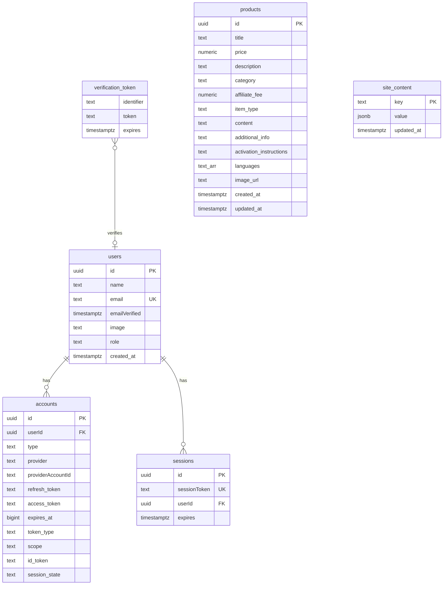
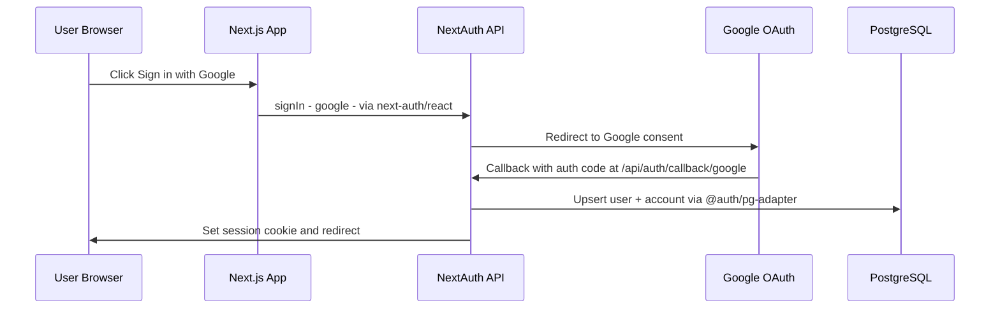
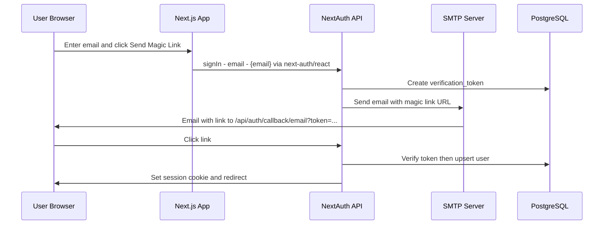

# Migration Plan: Supabase → Self-Hosted PostgreSQL

## 1. Overview

This document describes the complete migration of the **DamnModz** Next.js application from Supabase (hosted auth + database) to a **self-hosted PostgreSQL** server with **NextAuth.js v5 (Auth.js)** for authentication.

### What's Being Migrated

| Concern | Current (Supabase) | Target (Self-Hosted) |
|---|---|---|
| **Authentication** | Supabase Auth via `@supabase/ssr` | NextAuth.js v5 (Auth.js) with PostgreSQL adapter |
| **OAuth (Google)** | `supabase.auth.signInWithOAuth` | NextAuth Google provider |
| **Magic Links** | `supabase.auth.signInWithOtp` | NextAuth Email provider (via Nodemailer/Resend) |
| **Session Management** | Supabase cookies + middleware refresh | NextAuth JWT or DB sessions + `auth()` helper |
| **Database Queries** | Supabase JS client `.from().select()` | Direct SQL via `pg` Pool |
| **Row-Level Security** | Supabase RLS policies | Application-level auth guards (unchanged pattern) |
| **Owner Check** | `user.email` + `user.app_metadata.role` | `users.role` column in PostgreSQL |

### Why

- Remove dependency on Supabase hosted services
- Full control over the database and auth infrastructure
- Reduced latency by connecting directly to a self-hosted PostgreSQL instance
- No vendor lock-in

### PostgreSQL Connection

```
postgres://<user>:<password>@<host>:<port>/<database>?sslmode=disable
```

---

## 2. New Database Schema

All tables will be created in the target PostgreSQL database. The schema includes NextAuth.js required tables, the existing application tables (products, site_content), and modifications to track user roles.

### 2.1 Complete SQL Migration Script

```sql
-- ============================================================
-- DamnModz: Self-Hosted PostgreSQL Schema
-- Replaces Supabase Auth + Supabase DB
-- ============================================================

-- Enable UUID generation
CREATE EXTENSION IF NOT EXISTS "pgcrypto";

-- ────────────────────────────────────────────────────────────
-- NextAuth.js Required Tables
-- (per @auth/pg-adapter specifications)
-- ────────────────────────────────────────────────────────────

-- Users table (NextAuth + custom role column)
CREATE TABLE IF NOT EXISTS users (
  id          uuid PRIMARY KEY DEFAULT gen_random_uuid(),
  name        text,
  email       text UNIQUE NOT NULL,
  "emailVerified" timestamptz,
  image       text,
  role        text NOT NULL DEFAULT 'user',  -- 'user' | 'owner'
  created_at  timestamptz NOT NULL DEFAULT now()
);

-- Accounts table (OAuth provider linkage)
CREATE TABLE IF NOT EXISTS accounts (
  id                  uuid PRIMARY KEY DEFAULT gen_random_uuid(),
  "userId"            uuid NOT NULL REFERENCES users(id) ON DELETE CASCADE,
  type                text NOT NULL,
  provider            text NOT NULL,
  "providerAccountId" text NOT NULL,
  refresh_token       text,
  access_token        text,
  expires_at          bigint,
  token_type          text,
  scope               text,
  id_token            text,
  session_state       text,
  UNIQUE(provider, "providerAccountId")
);

-- Sessions table (for database session strategy, optional if using JWT)
CREATE TABLE IF NOT EXISTS sessions (
  id             uuid PRIMARY KEY DEFAULT gen_random_uuid(),
  "sessionToken" text UNIQUE NOT NULL,
  "userId"       uuid NOT NULL REFERENCES users(id) ON DELETE CASCADE,
  expires        timestamptz NOT NULL
);

-- Verification tokens (for magic link / email sign-in)
CREATE TABLE IF NOT EXISTS verification_token (
  identifier text NOT NULL,
  token      text NOT NULL,
  expires    timestamptz NOT NULL,
  UNIQUE(identifier, token)
);

-- Index for faster user lookups
CREATE INDEX IF NOT EXISTS idx_users_email ON users (email);
CREATE INDEX IF NOT EXISTS idx_accounts_userId ON accounts ("userId");
CREATE INDEX IF NOT EXISTS idx_sessions_userId ON sessions ("userId");

-- ────────────────────────────────────────────────────────────
-- Application Tables
-- ────────────────────────────────────────────────────────────

-- Products table (same schema as Supabase, no RLS)
CREATE TABLE IF NOT EXISTS products (
  id                      uuid        PRIMARY KEY DEFAULT gen_random_uuid(),
  title                   text        NOT NULL,
  price                   numeric(10,2) NOT NULL CHECK (price >= 0),
  description             text        NOT NULL,
  category                text        NOT NULL,
  affiliate_fee           numeric(5,2) NOT NULL CHECK (affiliate_fee >= 0 AND affiliate_fee <= 100),
  item_type               text        NOT NULL CHECK (item_type IN ('Key', 'In-Game item', 'Account', 'Subscription')),
  content                 text        NOT NULL,
  additional_info         text,
  activation_instructions text,
  languages               text[]      NOT NULL DEFAULT '{}',
  image_url               text,
  created_at              timestamptz NOT NULL DEFAULT now(),
  updated_at              timestamptz NOT NULL DEFAULT now()
);

CREATE INDEX IF NOT EXISTS idx_products_category  ON products (category);
CREATE INDEX IF NOT EXISTS idx_products_item_type ON products (item_type);
CREATE INDEX IF NOT EXISTS idx_products_created   ON products (created_at DESC);

-- Auto-update updated_at trigger
CREATE OR REPLACE FUNCTION update_updated_at()
RETURNS TRIGGER AS $$
BEGIN
  NEW.updated_at = now();
  RETURN NEW;
END;
$$ LANGUAGE plpgsql;

CREATE TRIGGER trg_products_updated_at
  BEFORE UPDATE ON products
  FOR EACH ROW
  EXECUTE FUNCTION update_updated_at();

-- Site content key-value table
CREATE TABLE IF NOT EXISTS site_content (
  key         text        PRIMARY KEY,
  value       jsonb       NOT NULL,
  updated_at  timestamptz NOT NULL DEFAULT now()
);

CREATE TRIGGER trg_site_content_updated_at
  BEFORE UPDATE ON site_content
  FOR EACH ROW
  EXECUTE FUNCTION update_updated_at();

-- ────────────────────────────────────────────────────────────
-- Seed owner user (will be linked on first login)
-- We pre-insert the owner email so the role is set on first OAuth/magic-link sign-in
-- ────────────────────────────────────────────────────────────
INSERT INTO users (email, role)
VALUES ('business@opuskeys.com', 'owner')
ON CONFLICT (email) DO UPDATE SET role = 'owner';
```

### 2.2 Entity Relationship Diagram



---

## 3. Dependencies

### 3.1 Packages to Install

| Package | Purpose |
|---|---|
| `next-auth@beta` | NextAuth.js v5 (Auth.js) — core auth library |
| `@auth/pg-adapter` | PostgreSQL adapter for NextAuth (uses `pg` Pool) |
| `nodemailer` | Send magic link emails (or use `@auth/resend-provider` as alternative) |
| `@types/nodemailer` | TypeScript types for nodemailer (devDependency) |

```bash
npm install next-auth@beta @auth/pg-adapter nodemailer
npm install -D @types/nodemailer
```

### 3.2 Packages to Remove

| Package | Reason |
|---|---|
| `@supabase/ssr` | No longer using Supabase client |
| `@supabase/supabase-js` | No longer using Supabase client |

```bash
npm uninstall @supabase/ssr @supabase/supabase-js
```

### 3.3 Packages to Move

| Package | From | To | Reason |
|---|---|---|---|
| `pg` | devDependencies | dependencies | Now used at runtime for database queries |

```bash
npm uninstall pg && npm install pg
npm install -D @types/pg
```

---

## 4. Environment Variables

### 4.1 Variables to Remove

```env
# Remove these from .env.local:
NEXT_PUBLIC_SUPABASE_URL=...
NEXT_PUBLIC_SUPABASE_ANON_KEY=...
SUPABASE_SERVICE_ROLE_KEY=...
SUPABASE_DB_PASSWORD=...
```

### 4.2 New `.env.local` Format

```env
# ── Database ───────────────────────────────────────────────
DATABASE_URL=postgres://<user>:<password>@<host>:<port>/<database>?sslmode=disable

# ── NextAuth.js ────────────────────────────────────────────
# Generate with: openssl rand -base64 32
AUTH_SECRET=<generate-a-random-secret>

# Base URL for callbacks (no trailing slash)
AUTH_URL=http://localhost:3000

# ── Google OAuth ───────────────────────────────────────────
# Get from: https://console.cloud.google.com/apis/credentials
AUTH_GOOGLE_ID=<google-client-id>
AUTH_GOOGLE_SECRET=<google-client-secret>

# ── Email (Magic Links via SMTP) ──────────────────────────
EMAIL_SERVER_HOST=smtp.example.com
EMAIL_SERVER_PORT=587
EMAIL_SERVER_USER=your-email@example.com
EMAIL_SERVER_PASSWORD=your-email-password
EMAIL_FROM=noreply@opuskeys.com
```

> **Note:** `NEXT_PUBLIC_*` Supabase variables are no longer needed. None of the new variables require the `NEXT_PUBLIC_` prefix since auth is handled server-side by NextAuth.

---

## 5. File Changes

### 5.1 Architecture Flow (Before vs After)

```mermaid
graph TD
    subgraph Before - Supabase
        A1[Browser] -->|Supabase JS Client| B1[Supabase Auth]
        A1 -->|Supabase JS Client| C1[Supabase DB]
        D1[Server Components] -->|Supabase Server Client| B1
        D1 -->|Supabase Server Client| C1
        E1[Middleware] -->|updateSession| B1
    end

    subgraph After - Self-Hosted
        A2[Browser] -->|next-auth/react| B2[NextAuth API Route]
        B2 -->|@auth/pg-adapter| C2[PostgreSQL]
        D2[Server Components] -->|auth helper| B2
        D2 -->|pg Pool| C2
        E2[Middleware] -->|NextAuth middleware| B2
    end
```

### 5.2 Files to CREATE

| File | Purpose |
|---|---|
| [`src/lib/db.ts`](src/lib/db.ts) | PostgreSQL connection pool using `pg`. Exports `pool` and query helper. |
| [`src/lib/auth/index.ts`](src/lib/auth/index.ts) | NextAuth.js v5 configuration — providers (Google, Email), pg-adapter, callbacks to include `role` in session/JWT. |
| [`src/app/api/auth/[...nextauth]/route.ts`](src/app/api/auth/[...nextauth]/route.ts) | NextAuth API route handler (GET + POST exports). |
| [`src/types/next-auth.d.ts`](src/types/next-auth.d.ts) | Module augmentation to add `role` to NextAuth `Session` and `User` types. |
| [`migrations/001_init.sql`](migrations/001_init.sql) | Full SQL schema file (Section 2.1 above) for the self-hosted PostgreSQL. |

### 5.3 Files to MODIFY

| File | Changes |
|---|---|
| [`src/middleware.ts`](src/middleware.ts) | Remove `updateSession` import from Supabase. Replace with NextAuth `auth` middleware export for session handling on bypass paths. Keep all locale routing logic intact. |
| [`src/components/Header.tsx`](src/components/Header.tsx) | Replace `createClient()` + `supabase.auth.getUser()` with NextAuth `auth()` to get session. Replace `isOwner(user)` with `session.user.role === 'owner'`. |
| [`src/components/HeaderActions.tsx`](src/components/HeaderActions.tsx) | Remove Supabase client + `User` type. Replace `supabase.auth.getUser()` / `onAuthStateChange()` with `useSession()` from `next-auth/react`. Remove `isOwner()` import; use `session.user.role` instead. |
| [`src/components/UserDropdown.tsx`](src/components/UserDropdown.tsx) | Remove Supabase client. Replace `signInWithOtp` with `signIn('email', ...)`. Replace `signInWithOAuth` with `signIn('google', ...)`. Replace `signOut()` with NextAuth `signOut()`. Replace `getUser()` / `onAuthStateChange` with `useSession()`. |
| [`src/app/[locale]/(auth)/_components/AuthCard.tsx`](src/app/[locale]/(auth)/_components/AuthCard.tsx) | Same as UserDropdown: replace all Supabase auth calls with NextAuth `signIn('email')`, `signIn('google')`. Remove Supabase client import. |
| [`src/app/(auth)/_components/AuthCard.tsx`](src/app/(auth)/_components/AuthCard.tsx) | Same changes as the locale-prefixed AuthCard above. |
| [`src/app/auth/callback/route.ts`](src/app/auth/callback/route.ts) | **Rewrite or delete.** NextAuth handles its own callbacks via `/api/auth/callback/*`. This route can redirect to the NextAuth callback or be removed entirely. |
| [`src/app/admin/layout.tsx`](src/app/admin/layout.tsx) | Replace `createClient()` + `supabase.auth.getUser()` with `auth()`. Replace `isOwner(user)` with `session?.user?.role === 'owner'`. |
| [`src/app/admin/products/actions.ts`](src/app/admin/products/actions.ts) | **Major rewrite:** (1) Replace Supabase auth guards with `auth()` from NextAuth. (2) Replace all `supabase.from('products').*` calls with direct SQL via `pool.query()`. |
| [`src/lib/auth/owner.ts`](src/lib/auth/owner.ts) | Rewrite to accept a NextAuth `Session['user']` instead of Supabase `User`. Check `user.role === 'owner'` OR `user.email` in `OWNER_EMAILS`. |
| [`package.json`](package.json) | Update dependencies (see Section 3). |
| [`next.config.js`](next.config.js) | Remove `*.supabase.co` from `images.remotePatterns` if no longer needed. |
| [`src/app/layout.tsx`](src/app/layout.tsx) | Wrap the app with `<SessionProvider>` from `next-auth/react` for client-side session access. |

### 5.4 Files to DELETE

| File | Reason |
|---|---|
| [`src/lib/supabase/client.ts`](src/lib/supabase/client.ts) | Supabase browser client — replaced by `next-auth/react` hooks |
| [`src/lib/supabase/server.ts`](src/lib/supabase/server.ts) | Supabase server client — replaced by `auth()` + `pool.query()` |
| [`src/lib/supabase/middleware.ts`](src/lib/supabase/middleware.ts) | Supabase session refresh — replaced by NextAuth middleware |
| [`scripts/setup-supabase.mjs`](scripts/setup-supabase.mjs) | Supabase-specific setup script — no longer relevant |
| [`supabase/`](supabase/) (entire directory) | Supabase migrations and config — replaced by `migrations/` |

---

## 6. Detailed File Specifications

### 6.1 `src/lib/db.ts` — Database Connection Pool

Creates and exports a `pg.Pool` connected to the self-hosted PostgreSQL. All database queries will go through this pool.

```typescript
// Pseudocode structure:
import { Pool } from 'pg';

const pool = new Pool({
  connectionString: process.env.DATABASE_URL,
});

export default pool;
export async function query(text: string, params?: unknown[]) {
  return pool.query(text, params);
}
```

### 6.2 `src/lib/auth/index.ts` — NextAuth Configuration

```typescript
// Pseudocode structure:
import NextAuth from 'next-auth';
import Google from 'next-auth/providers/google';
import Email from 'next-auth/providers/email';
import PostgresAdapter from '@auth/pg-adapter';
import pool from '@/lib/db';

export const { handlers, auth, signIn, signOut } = NextAuth({
  adapter: PostgresAdapter(pool),
  providers: [
    Google({
      clientId: process.env.AUTH_GOOGLE_ID,
      clientSecret: process.env.AUTH_GOOGLE_SECRET,
    }),
    Email({
      server: {
        host: process.env.EMAIL_SERVER_HOST,
        port: Number(process.env.EMAIL_SERVER_PORT),
        auth: {
          user: process.env.EMAIL_SERVER_USER,
          pass: process.env.EMAIL_SERVER_PASSWORD,
        },
      },
      from: process.env.EMAIL_FROM,
    }),
  ],
  callbacks: {
    // Include role in the session object
    async session({ session, user }) {
      // user comes from the DB adapter with the role column
      session.user.role = user.role;
      return session;
    },
  },
  pages: {
    signIn: '/login',          // Custom sign-in page
    verifyRequest: '/login',   // After magic link sent
    error: '/login',           // Auth errors
  },
});
```

### 6.3 `src/app/api/auth/[...nextauth]/route.ts`

```typescript
import { handlers } from '@/lib/auth';
export const { GET, POST } = handlers;
```

### 6.4 `src/types/next-auth.d.ts` — Type Augmentation

```typescript
import { DefaultSession } from 'next-auth';

declare module 'next-auth' {
  interface User {
    role?: string;
  }
  interface Session {
    user: {
      role?: string;
    } & DefaultSession['user'];
  }
}
```

### 6.5 `src/middleware.ts` — Updated Middleware

The middleware must preserve locale routing while replacing Supabase session refresh with NextAuth:

```typescript
// Pseudocode — key changes only:
import { auth } from '@/lib/auth';       // replaces updateSession import
import { locales, defaultLocale, isValidLocale } from '@/i18n/config';

// Locale routing logic stays exactly the same

export async function middleware(request) {
  // For bypass paths (admin, api, _next, img):
  //   Just return NextResponse.next() — no more updateSession()
  //   NextAuth handles its own session via /api/auth/*
  
  // For locale paths:
  //   Same redirect logic as before
  //   Remove updateSession() call
}

// Add NextAuth to the middleware chain via config:
export { auth as authMiddleware } from '@/lib/auth';

// Alternatively, wrap the middleware:
export default auth(middleware);
```

> **Key insight:** Supabase required `updateSession()` on every request to refresh cookies. NextAuth.js v5 does NOT need this — sessions are managed via the `/api/auth/session` endpoint and cookies are handled automatically.

### 6.6 `src/app/admin/products/actions.ts` — Database Query Migration

Each Supabase `.from()` call maps to a direct SQL query:

| Supabase Call | SQL Replacement |
|---|---|
| `.from('products').select('*', { count: 'exact' }).order('created_at', { ascending: false }).range(from, to)` | `SELECT *, COUNT(*) OVER() AS total FROM products ORDER BY created_at DESC LIMIT $1 OFFSET $2` |
| `.from('products').insert({...})` | `INSERT INTO products (title, price, ...) VALUES ($1, $2, ...)` |
| `.from('products').update({...}).eq('id', id)` | `UPDATE products SET title=$1, price=$2, ... WHERE id=$N` |
| `.from('products').delete().eq('id', id)` | `DELETE FROM products WHERE id = $1` |

Auth guards change from:
```typescript
const supabase = await createClient();
const { data: { user } } = await supabase.auth.getUser();
if (!user || !isOwner(user)) { ... }
```
To:
```typescript
const session = await auth();
if (!session?.user || session.user.role !== 'owner') { ... }
```

---

## 7. Auth Flow Comparison

### 7.1 Google OAuth Flow



### 7.2 Magic Link Flow



---

## 8. Ordered Implementation Steps

### Phase 1: Database Setup
1. **Run the SQL migration** script (Section 2.1) against the self-hosted PostgreSQL server
2. **Verify** all tables are created: `users`, `accounts`, `sessions`, `verification_token`, `products`, `site_content`
3. **Verify** the seed owner user (`business@opuskeys.com` with `role = 'owner'`) exists

### Phase 2: Dependencies
4. **Install** new packages: `next-auth@beta`, `@auth/pg-adapter`, `nodemailer`, `@types/nodemailer`, `@types/pg`
5. **Move** `pg` from devDependencies to dependencies
6. **Remove** `@supabase/ssr` and `@supabase/supabase-js`

### Phase 3: Core Auth Infrastructure
7. **Create** [`src/lib/db.ts`](src/lib/db.ts) — PostgreSQL connection pool
8. **Create** [`src/lib/auth/index.ts`](src/lib/auth/index.ts) — NextAuth config with Google + Email providers and pg-adapter
9. **Create** [`src/app/api/auth/[...nextauth]/route.ts`](src/app/api/auth/[...nextauth]/route.ts) — API route handler
10. **Create** [`src/types/next-auth.d.ts`](src/types/next-auth.d.ts) — Type augmentation for `role`
11. **Update** [`.env.local`](.env.local) — Replace Supabase vars with new vars (Section 4.2)

### Phase 4: Middleware
12. **Update** [`src/middleware.ts`](src/middleware.ts) — Remove `updateSession` import, integrate NextAuth middleware while preserving locale routing logic

### Phase 5: Auth UI Components
13. **Update** [`src/app/layout.tsx`](src/app/layout.tsx) — Wrap with `<SessionProvider>`
14. **Update** [`src/components/UserDropdown.tsx`](src/components/UserDropdown.tsx) — Replace Supabase auth calls with NextAuth `signIn()` / `signOut()` / `useSession()`
15. **Update** [`src/components/HeaderActions.tsx`](src/components/HeaderActions.tsx) — Replace Supabase with `useSession()` and `session.user.role`
16. **Update** [`src/components/Header.tsx`](src/components/Header.tsx) — Replace Supabase server client with `auth()` helper
17. **Update** [`src/app/[locale]/(auth)/_components/AuthCard.tsx`](src/app/[locale]/(auth)/_components/AuthCard.tsx) — Replace Supabase auth methods
18. **Update** [`src/app/(auth)/_components/AuthCard.tsx`](src/app/(auth)/_components/AuthCard.tsx) — Same as above

### Phase 6: Admin & Database Queries
19. **Update** [`src/lib/auth/owner.ts`](src/lib/auth/owner.ts) — Accept NextAuth user type, check `role` column
20. **Update** [`src/app/admin/layout.tsx`](src/app/admin/layout.tsx) — Use `auth()` + role check
21. **Update** [`src/app/admin/products/actions.ts`](src/app/admin/products/actions.ts) — Replace Supabase auth with `auth()`, replace all `.from()` calls with `pool.query()` SQL

### Phase 7: Cleanup
22. **Delete** [`src/lib/supabase/client.ts`](src/lib/supabase/client.ts)
23. **Delete** [`src/lib/supabase/server.ts`](src/lib/supabase/server.ts)
24. **Delete** [`src/lib/supabase/middleware.ts`](src/lib/supabase/middleware.ts)
25. **Delete** [`scripts/setup-supabase.mjs`](scripts/setup-supabase.mjs)
26. **Delete** [`supabase/`](supabase/) directory
27. **Delete or rewrite** [`src/app/auth/callback/route.ts`](src/app/auth/callback/route.ts) — NextAuth handles callbacks at `/api/auth/callback/*`; this can redirect there or be removed
28. **Update** [`next.config.js`](next.config.js) — Remove `*.supabase.co` from image remote patterns

### Phase 8: Testing
29. **Test** Google OAuth sign-in flow end-to-end
30. **Test** Magic link sign-in flow end-to-end
31. **Test** Owner role detection (`business@opuskeys.com` should see admin panel)
32. **Test** Admin products CRUD (create, read, update, delete)
33. **Test** Locale routing still works correctly (en/es/pl redirect + cookie persistence)
34. **Test** Unauthenticated users cannot access `/admin/*`
35. **Test** Sign out clears session properly

---

## 9. Risk Considerations

| Risk | Mitigation |
|---|---|
| **Data loss during migration** | Products/site_content must be exported from Supabase and imported into the new DB before switching |
| **Magic link email delivery** | Requires a working SMTP server or email API (Resend, SendGrid, etc.) — test in staging first |
| **Google OAuth redirect URIs** | Must update Google Cloud Console to add `/api/auth/callback/google` as an authorized redirect URI |
| **Session format change** | All existing Supabase sessions will be invalidated — users must re-authenticate |
| **`sslmode=disable`** | Connection is unencrypted — acceptable for development, but production should use SSL |
| **No `NEXT_PUBLIC_` auth vars** | NextAuth handles auth server-side, so client components use `useSession()` hook instead of direct API calls — no keys exposed to the browser |

---

## 10. Data Migration Checklist

Before going live with the new system:

- [ ] Export `products` table data from Supabase → import into self-hosted PostgreSQL
- [ ] Export `site_content` table data from Supabase → import into self-hosted PostgreSQL
- [ ] Update Google OAuth authorized redirect URI to `{AUTH_URL}/api/auth/callback/google`
- [ ] Configure SMTP credentials for magic link emails
- [ ] Generate `AUTH_SECRET` and add to `.env.local`
- [ ] Verify PostgreSQL is accessible from the deployment environment
